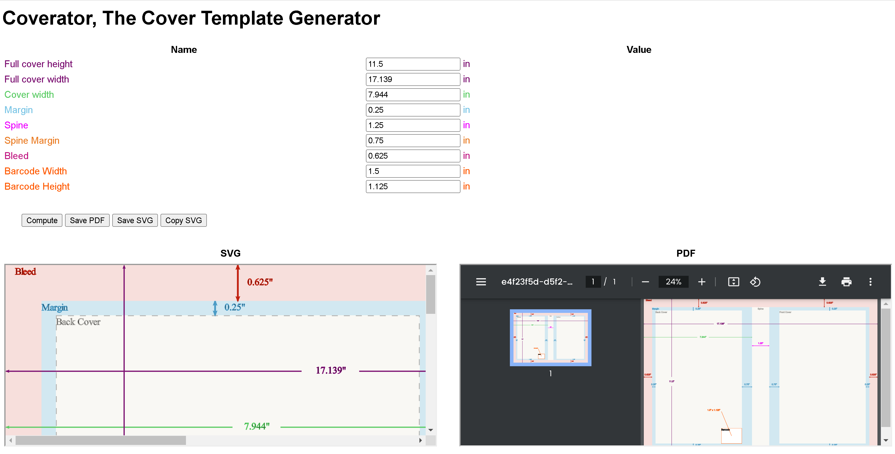
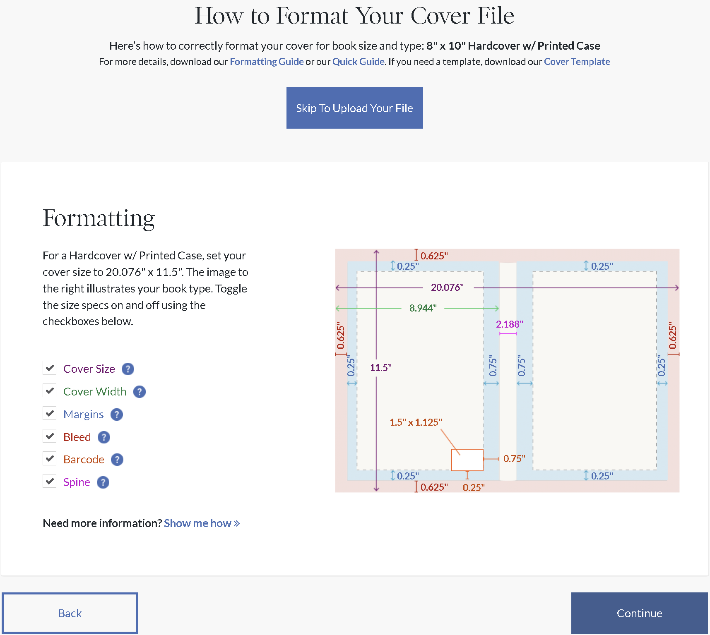
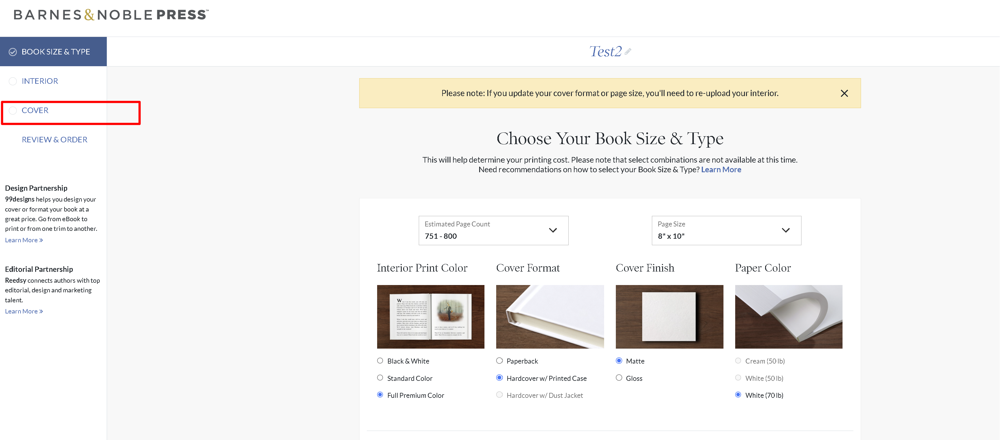
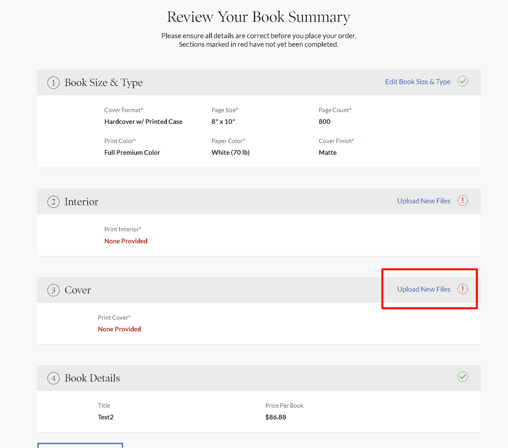
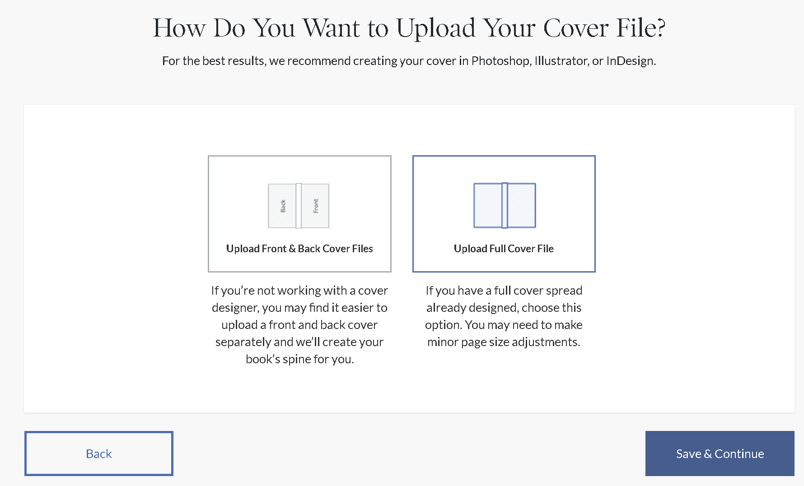

# coverator

**Cover Template Generator for Barnes and Noble Press**



Use here:
[realazthat.github.io/coverator](https://realazthat.github.io/coverator).

## What is it?

This is a simple tool to generate a cover template making book covers for Barnes
and Noble Press.

It is a simple web page that allows you to enter the dimensions of your book and
will generate a template for you to use in your favorite image editor, to guide
the borders of your cover.

This is what **Barnes and Noble Press interface** looks like:



This is what **coverator** looks like:


## How to use it?

Workflow is:

<sup><sup>B&N Press &gt; Get Dimensions &gt; coverator &gt; Download Template
&gt; Image Editor &gt; Upload To B&N Press</sup></sup>

1. Go to [press.barnesandnoble.com](https://press.barnesandnoble.com) and create
   a new project, entering the dimensions of your book, and number of pages,
   type of pages etc.
2. Navigate to the **How Do You Want to Upload Your Cover File?** page. You can
   get here a few ways.
   <div>
   </div>

3. This template is for the "**Upload Full Cover File**" option. So click that.
   <div></div>

4. Next, you should see a page titled "**How To Format Your Cover File**". Copy
   the various lengths over the the **coverator** equivalent input boxes at
   [realazthat.github.io/coverator](https://realazthat.github.io/coverator).
   <div> </div>

## Running Locally

```bash

npm install
npm run start
# Navigate to http://localhost:1234/coverator/. Note the trailing slash!


npm run build
npm run serve
# Navigate to http://localhost:3000/coverator/. Note the trailing slash!
```
